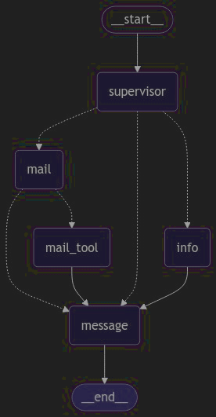

# Communication Assistant

AI communication assistant for Sarthak Kakkar's portfolio. The app lets employers ask profile-related questions and request an email follow-up.



## Stack

- FastAPI backend
- LangChain/LangGraph agent flow
- DeepSeek OpenAI-compatible chat API
- React + Vite frontend
- Gmail SMTP for notification emails

## Backend Setup

```bash
cd backend
python -m venv venv
source venv/bin/activate
python -m pip install -r requirements.txt
```

Create `backend/.env`:

```bash
DEEPSEEK_API_KEY=your_deepseek_key
DEEPSEEK_BASE_URL=https://api.deepseek.com
DEEPSEEK_MODEL=deepseek-v4-flash

BOT_MAIL_ID=your_gmail_address
BOT_MAIL_PASSWORD=your_gmail_app_password

# Optional retrieval service
RETRIEVAL_ENDPOINT=
RETRIEVAL_API_KEY=

# Optional LangSmith tracing
LANGCHAIN_TRACING_V2=false
LANGCHAIN_API_KEY=
LANGCHAIN_PROJECT=Communication_Assistant
```

Run the backend:

```bash
uvicorn app:app --reload --port 8000
```

From the project root, use:

```bash
uvicorn backend.app:app --reload --port 8000
```

Health check:

```bash
curl http://127.0.0.1:8000/health
```

## Frontend Setup

```bash
cd com-agent-frontend
npm install
```

Create `com-agent-frontend/.env`:

```bash
VITE_API_URL=http://127.0.0.1:8000
```

Run the frontend:

```bash
npm run dev
```

## DeepSeek Notes

The backend uses `backend/agent_graph/deepseek.py` to centralize DeepSeek configuration:

- Base URL defaults to `https://api.deepseek.com`
- Model defaults to `deepseek-v4-flash`
- Thinking mode is disabled for deterministic app responses
- JSON mode is enabled for parser-based agents

Override `DEEPSEEK_MODEL` if you want to use another supported DeepSeek model.

## Dependency Note

Keep the pinned LangChain/LangGraph versions in `requirements.txt` and `backend/requirements.txt`. Mixing old `langgraph` with newer split packages such as `langgraph-checkpoint` or `langgraph-prebuilt` can cause runtime graph errors.
